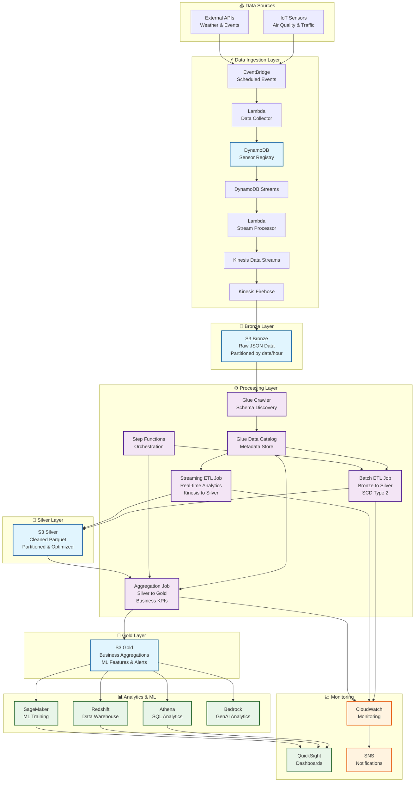
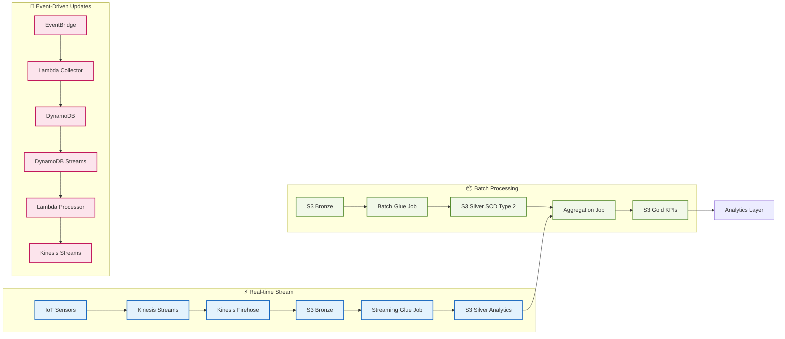
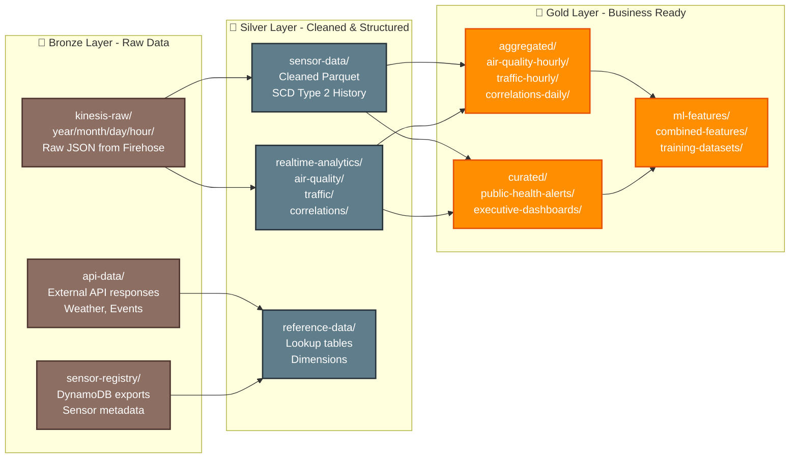
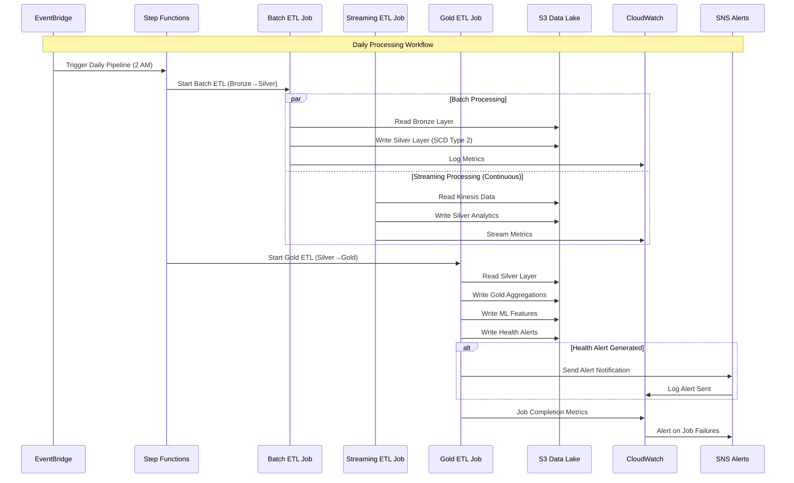

# Smart City Real-Time Analytics Platform

---

## 🏙️ Project Overview

This project implements a **scalable, real-time data analytics platform** for smart city IoT sensors, processing air quality and traffic data to provide actionable insights for urban planning and public health monitoring.

---

## 🎯 Key Features

- ⚡ **Real-time Processing**: Stream processing of IoT sensor data with sub-minute latency
- 📊 **Batch Analytics**: Daily aggregations and historical trend analysis
- 🚨 **Public Health Alerts**: Automated alerts for air quality hazards
- 🤖 **ML-Ready Datasets**: Feature engineering for predictive analytics
- 🏗️ **Multi-layer Architecture**: Bronze → Silver → Gold data lake pattern
- 📈 **Scalable Infrastructure**: Auto-scaling AWS services with cost optimization

---

## 🏗️ Architecture Overview



---

## 🌊 Data Flow Architecture



---

## 📊 Data Lake Architecture (Bronze → Silver → Gold)



---

## 🔄 ETL Job Processing Flow



---

## 🛠️ Technology Stack

### Data Ingestion
- **Amazon EventBridge**: Event scheduling and routing
- **AWS Lambda**: Serverless data collection and processing
- **Amazon DynamoDB**: Sensor registry and metadata
- **DynamoDB Streams**: Change data capture
- **Amazon Kinesis Data Streams**: Real-time data streaming
- **Amazon Kinesis Data Firehose**: Data delivery to S3

### Storage & Data Lake
- **Amazon S3**: Multi-layer data lake (Bronze/Silver/Gold)
- **AWS Glue Data Catalog**: Metadata management
- **AWS Lake Formation**: Data governance and security

### Processing & ETL
- **AWS Glue**: Serverless ETL jobs (Batch & Streaming)
- **Apache Spark**: Distributed data processing
- **AWS Step Functions**: Workflow orchestration
- **AWS Glue Crawlers**: Automated schema discovery

### Analytics & ML
- **Amazon Athena**: Serverless SQL analytics
- **Amazon Redshift**: Data warehousing
- **Amazon SageMaker**: Machine learning platform
- **Amazon Bedrock**: Generative AI analytics

### Visualization & Monitoring
- **Amazon QuickSight**: Business intelligence dashboards
- **Amazon CloudWatch**: Monitoring and alerting
- **Amazon SNS**: Notification service

### Security & Governance
- **AWS IAM**: Identity and access management
- **AWS KMS**: Encryption key management
- **AWS Lake Formation**: Fine-grained access control

---

## 📁 Project Structure

```
smart-city-analytics-pipeline/
├── 📄 README.md                          # This file
├── 📁 glue-jobs/                         # ETL job scripts
│   ├── 🐍 batch-etl-bronze-to-silver.py    # SCD Type 2 processing
│   ├── 🐍 streaming-etl-kinesis-to-silver.py # Real-time analytics
│   └── 🐍 silver-to-gold-etl.py            # Business aggregations
├── 📁 infrastructure/                    # Infrastructure as Code
│   ├── 📁 kinesis/
│   │   └── 📄 kinesis-stack.yaml           # Kinesis resources
│   ├── 📁 s3/
│   │   └── 📄 s3-stack.yaml                # S3 data lake setup
│   ├── 📁 glue/
│   │   └── 📄 glue-stack.yaml              # Glue jobs and catalog
│   ├── 📁 athena/
│   │   └── 📄 athena-stack.yaml            # Athena workgroups & queries
│   └── 📁 lambda/
│       └── 📄 lambda-functions.yaml        # Lambda functions
├── 📁 lambda-functions/                  # Lambda source code
│   ├── 🐍 data-collector/                  # IoT data collection
│   ├── 🐍 stream-processor/                # DynamoDB stream processing
│   ├── 🐍 data-validator/                  # Data quality validation
│   └── 🐍 alert-handler/                   # Health alert notifications
├── 📁 sql-queries/                       # Athena & Redshift queries
│   ├── 📄 athena-tables.sql                # Table creation scripts
│   ├── 📄 analytics-queries.sql            # Business analytics
│   └── 📄 ml-feature-queries.sql           # ML feature engineering
├── 📁 data-samples/                      # Sample data for testing
│   ├── 📄 air-quality-sample.json
│   └── 📄 traffic-sample.json
├── 📁 docs/                             # Documentation
│   ├── 📄 architecture.md                  # Detailed architecture
│   ├── 📄 data-flow.md                     # Data flow documentation
│   ├── 📄 deployment-guide.md              # Deployment instructions
│   └── 📄 troubleshooting.md               # Common issues & solutions
├── 📁 scripts/                          # Deployment & utility scripts
│   ├── 📁 deployment/
│   │   ├── 🔧 deploy.sh                    # Main deployment script
│   │   ├── 🔧 setup-environment.sh         # Environment setup
│   │   └── 🔧 cleanup.sh                   # Resource cleanup
│   └── 📁 monitoring/
│       ├── 🐍 health-check.py              # Pipeline health monitoring
│       └── 🐍 cost-optimizer.py            # Cost optimization
├── 📁 quicksight/                       # Dashboard templates
│   ├── 📄 air-quality-dashboard.json
│   ├── 📄 traffic-analytics-dashboard.json
│   └── 📄 executive-summary-dashboard.json
├── 📁 sagemaker/                        # ML notebooks & models
│   ├── 📓 air-quality-prediction.ipynb
│   ├── 📓 traffic-pattern-analysis.ipynb
│   └── 📁 models/
└── 📁 tests/                            # Unit & integration tests
    ├── 🧪 test-glue-jobs.py
    ├── 🧪 test-lambda-functions.py
    └── 📁 integration/
```

---

## 🚀 Quick Start

### Prerequisites

- AWS CLI configured with appropriate permissions
- Python 3.9+
- AWS CDK or CloudFormation access

### 1. Clone Repository

```bash
git clone https://github.com/yourusername/smart-city-analytics-pipeline.git
cd smart-city-analytics-pipeline
```

### 2. Deploy Infrastructure

```bash
# Make deployment script executable
chmod +x scripts/deployment/deploy.sh

# Deploy to development environment
./scripts/deployment/deploy.sh dev us-east-1 default
```

### 3. Upload Sample Data

```bash
# Upload sample IoT sensor data
aws s3 cp data-samples/ s3://smart-city-datalake-dev-{account-id}/sample-data/ --recursive
```

### 4. Start Processing Jobs

```bash
# Start streaming ETL job
aws glue start-job-run --job-name smart-city-streaming-etl-dev

# Trigger batch processing
aws stepfunctions start-execution \
  --state-machine-arn arn:aws:states:us-east-1:{account}:stateMachine:smart-city-pipeline-dev \
  --input '{}'
```

---

## 📊 Data Processing Details

### Bronze Layer (Raw Data)
- **Format**: JSON (from Kinesis Firehose)
- **Partitioning**: `year=YYYY/month=MM/day=DD/hour=HH`
- **Retention**: 90 days (lifecycle policy)
- **Compression**: GZIP

### Silver Layer (Cleaned Data)
- **Format**: Parquet (columnar, compressed)
- **Schema**: Validated and standardized
- **SCD Type 2**: Historical tracking with effective dates
- **Partitioning**: By processing date and data type

### Gold Layer (Business Ready)
- **Aggregated Data**: Hourly/daily rollups
- **ML Features**: Feature-engineered datasets
- **Curated Views**: Executive dashboards, alerts
- **Format**: Parquet optimized for analytics

---

## 🔍 Key Analytics Use Cases

### 1. Air Quality Monitoring

```sql
-- Real-time air quality alerts
SELECT zone, hourly_avg_pm25, air_quality_index, health_risk_score
FROM gold_aggregated_air_quality_hourly
WHERE processing_date = current_date
  AND health_risk_score >= 4
ORDER BY health_risk_score DESC;
```

### 2. Traffic Pattern Analysis

```sql
-- Peak hour traffic efficiency
SELECT zone, hour_of_day, avg(traffic_efficiency_score) as avg_efficiency
FROM gold_aggregated_traffic_hourly
WHERE processing_date >= current_date - interval '30' day
  AND peak_hour_indicator = 'PEAK'
GROUP BY zone, hour_of_day
ORDER BY avg_efficiency ASC;
```

### 3. Pollution-Traffic Correlation

```sql
-- Environmental impact analysis
SELECT zone, correlation_strength, avg(environmental_impact_score) as avg_impact
FROM gold_aggregated_correlations_daily
WHERE processing_date >= current_date - interval '90' day
GROUP BY zone, correlation_strength
ORDER BY avg_impact DESC;
```

---

## 🤖 Machine Learning Features

### Predictive Models
- **Air Quality Forecasting**: Predict PM2.5 levels 24 hours ahead
- **Traffic Congestion Prediction**: Anticipate traffic patterns
- **Anomaly Detection**: Identify unusual sensor readings

### Feature Engineering
- **Time-based Features**: Hour, day of week, seasonality
- **Spatial Features**: Zone-based aggregations
- **Lag Features**: Historical values for time series
- **Interaction Features**: Pollution-traffic relationships

---

## 📈 Monitoring & Alerting

### CloudWatch Metrics
- **Data Pipeline Health**: Job success rates, processing latency
- **Data Quality**: Record counts, validation failures
- **Cost Optimization**: Resource utilization, storage costs

### Automated Alerts
- **Health Alerts**: Air quality exceeds safe thresholds
- **System Alerts**: ETL job failures, data quality issues
- **Cost Alerts**: Unexpected spending increases

---

## 🔐 Security & Compliance

### Data Encryption
- **At Rest**: S3 server-side encryption (SSE-S3)
- **In Transit**: TLS 1.2 for all data transfers
- **Key Management**: AWS KMS for sensitive data

### Access Control
- **IAM Roles**: Least privilege principle
- **Lake Formation**: Fine-grained table/column permissions
- **VPC**: Network isolation for processing resources

### Data Governance
- **Data Catalog**: Centralized metadata management
- **Lineage Tracking**: Data flow documentation
- **Audit Logging**: CloudTrail for all API calls

---

## 💰 Cost Optimization

### Storage Optimization
- **Intelligent Tiering**: Automatic S3 storage class transitions
- **Data Lifecycle**: Automated archival and deletion
- **Compression**: Parquet with Snappy compression

### Compute Optimization
- **Glue Auto Scaling**: Dynamic worker allocation
- **Spot Instances**: Cost-effective processing
- **Scheduled Jobs**: Off-peak processing when possible

---

## 🚨 Troubleshooting

### Common Issues

#### Glue Job Failures

```bash
# Check job logs
aws logs describe-log-groups --log-group-name-prefix "/aws-glue/jobs"

# Monitor job metrics
aws cloudwatch get-metric-statistics \
  --namespace AWS/Glue \
  --metric-name glue.driver.aggregate.numCompletedTasks
```

#### Data Quality Issues

```bash
# Validate data schema
aws glue get-table --database-name smart_city_dev --name bronze_sensor_data

# Check partition discovery
aws glue start-crawler --name smart-city-bronze-crawler-dev
```

#### Performance Optimization

```bash
# Monitor S3 request metrics
aws cloudwatch get-metric-statistics \
  --namespace AWS/S3 \
  --metric-name NumberOfObjects \
  --dimensions Name=BucketName,Value=smart-city-datalake-dev
```


</div>
